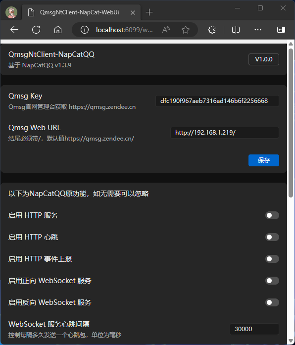

# Qmsg NT Client from NapCatQQ
适用于Linux/Linux-Docker QQNT的Qmsg酱机器人客户端
> 基于NapCatQQ
> https://github.com/NapNeko/NapCatQQ

如果你使用Windows/MacOS，那么推荐使用 https://github.com/1244453393/QmsgNtClient `相较于NapCatQQ更加稳定`
## 安装Qmsg NT Client
https://qmsg.zendee.cn/docs/pvt
## Qmsg酱官网
https://qmsg.zendee.cn
## 我的万年不更新博客
https://www.zendee.cn
## WEB设置界面
此图并非最新版界面，请以安装后的界面为准

## Qmsg酱形象

